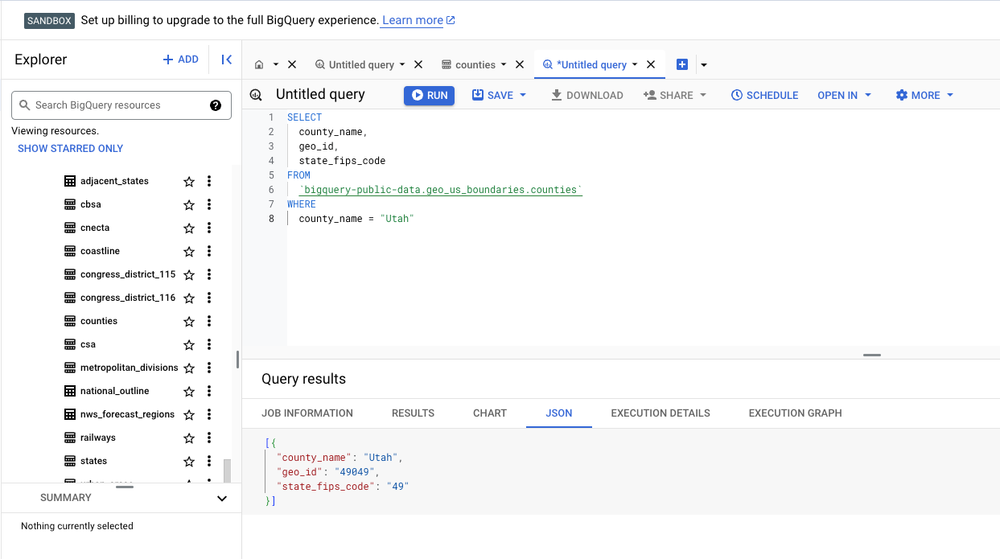

# P8 (5% of grade): BigQuery, Loans Data

## Overview

In this project, we'll study the use of several offerings from Google Cloud Platform (GCP), including BigQuery and GCS.
You'll be combining data from several sources: a public BigQuery dataset
describing the geography of US counties, the HDMA loans dataset used
previously this semester, and pretend loan applications made via a
Google form (you'll make some submissions yourself and then
immediately analyze the results).

Learning objectives:
* combine data from a variety of sources to compute results in BigQuery
* query live results from a Google form/sheet
* train linear regression model using BigQuery
* manipulate geographic data

Before starting, please review the [general project directions](../projects.md).

## Clarifications/Correction

* none yet

# Setup

### venv
Setup a Python `venv` for this project **inside your project directory**.
```shell
sudo apt install python3.12-venv # or whatever python version you have installed
python3 -m venv venv
source venv/bin/activate
```

### Dependencies

Install dependencies for your activated `venv` with `pip3`

```
pip3 install jupyterlab google-cloud-bigquery google-cloud-bigquery-storage pyarrow tqdm ipywidgets pandas matplotlib db-dtypes pandas-gbq
```

#### Google cloud CLI (if applicable)

**Only** run this if `gcloud` is not a valid command on your VM (Debian/Ubuntu):

```shell
curl https://packages.cloud.google.com/apt/doc/apt-key.gpg | sudo gpg --dearmor -o /usr/share/keyrings/cloud.google.gpg
echo "deb [signed-by=/usr/share/keyrings/cloud.google.gpg] https://packages.cloud.google.com/apt cloud-sdk main" | sudo tee -a /etc/apt/sources.list.d/google-cloud-sdk.list
sudo apt-get update && sudo apt-get install google-cloud-cli
```

You'll also need to give your VM permission to access BigQuery and
Google Drive.  You can do so by pasting the following into the
terminal on your VM and following the directions. Please read the following cautions before running this command.

```
gcloud auth application-default login --scopes=openid,https://www.googleapis.com/auth/cloud-platform,https://www.googleapis.com/auth/drive.readonly
```

### Caution

1. While running the command, it will ask you to paste some link to your browser. If you have multiple Google accounts in your browser, and do not want this to select the default one, then do the following: 
    * paste the link in an incognito mode
    * login to the Google account of your choice
2. **Be careful**, because if a malicious party were to gain access to your
VM, they would have free access to all your Google Drive files (and
more).  For example, if your Jupyter is listening publicly (i.e.,
0.0.0.0 instead of localhost) and you have a weak password (or no
password), someone could gain access to your VM, and then these other
resources.
3. You may need to run this command again if you run into an error like `"Reauthentication is needed"`.

When you're not actively working, you may want to revoke (take away)
the permissions your VM has to minimize risk:

```bash
gcloud auth application-default revoke
```

(Optional) If you're worried about exhausting the free tier and your educational
credits, you might also want to setup a quota [here](https://console.cloud.google.com/iam-admin/quotas).

## Notebook

You'll create a `p8.ipynb` notebook inside of `src/`.  You'll answer 10 questions in the notebook.

With your `venv` still active, run:

```bash
python3 -m jupyterlab --no-browser
```

1. Setup an SSH tunnel and connect (as done in previous projects)
2. You'll be prompted to copy/paste a token from the terminal to the browser. 
3. Finally, create a notebook named `p8.ipynb` inside of `src/`.


## Outputs

> **Important:**
> 
> If the output of a cell answers question
3, start the cell with a comment: `#q3`.  The autograder depends on
this to correlate parts of your output with specific questions.

> **Important**:
>
> The autograder will extract your output from these cells, so it won't
give points if not formatted correctly (extra spaces, split cells,
etc.).
>
> For this project, answers are simple types (e.g., `int`s,
`float`s, `dict`s), so you'll need to do a little extra work to get
results out of the DataFrames you get from BigQuery.

## Part 1: County Data (Public Dataset)

### Dataset
For this part, you'll use the
`bigquery-public-data.geo_us_boundaries.counties` table.  This
contains names, IDs, boundaries, and more for every county in the
United States.

### Schema
You can view the schema of this dataset (this might be helpful to reference for this project)
If we hadn't provided you with the name of the table, you could have found
it yourself as follows:

1. Visit [Google Marketplace](https://console.cloud.google.com/marketplace)
2. Using the Category, Type, and Price filters select "Maps", "Datasets", and "Free" respectively
3. Click "Census Bureau US Boundaries"
4. Click "VIEW DATASET"
5. From this view, you can expand the `geo_us_boundaries` dataset to see `counties` and other related tables; you can also browse the other datasets under the `bigquery-public-data` category
   - When viewing a BQ table, there are multiple tabs that are useful, including `schema` and `preview`

### SQL Editor
Once you have the table selected, you can also click `Query > In new tab` to open a SQL editor with the table loaded.

This page is very useful to write SQL queries from scratch. Any SQL query that executes here will also be able to execute in the Python client.

You will need to reference this page to answer a few questions while writing and executing your queries.

> Tip: You can click on More > Format Query to "prettify" your query string



# Questions

#### Q1: What is the `geo_id` for Dane county? 

###### Expected return type: `str`


#### Q2: How many counties are there per state? Answer for the **five** states with the most counties.

###### Expected return type: a Python dict, where the keys are the state FIPS codes (which are strings) and the values are the counts (ints).


#### Q3: How much do the queries for the last two questions cost, in terms of bytes billed? Answer for both `q1` and `q2` with human readable strings using "MB" for units (like "50 MB").

Hint: if you run the query more than once, bytes billed might appear as zero, due to cached results.  To get actual cost for a fresh run, disable caching as in lecture:

https://git.doit.wisc.edu/cdis/cs/courses/cs544/f24/main/-/tree/main/lec/37-bq?ref_type=heads

The result should be something like this, with bytes replacing the "????" parts:

```
{
    "q1": "????",
    "q2": "????"
}
```

## Part 2: HDMA Data (Parquet in GCS)

### Setup
Download https://pages.cs.wisc.edu/~harter/cs544/data/hdma-wi-2021.parquet. 

Navigate to [Google Cloud Storage WebUI](https://console.cloud.google.com/storage/):
1. Create a private GCS bucket.  You can name it whatever you want.  For example, we used `cs544_p8`.  Names must be globally unique, though, and we used that one, so you'll need to choose another name.
2. Upload the parquet file to your bucket.

Write code to create a dataset called `p8` in your GCP project.  Use
`exists_ok=True` so that you can re-run your code without errors. Load the data into a new table called `hdma`.

> Note: Once you've uploaded your table successfully, you should be able to see it (schema, preview, etc.) in the [BigQuery explorer](https://console.cloud.google.com/bigquery):
> 
> `{project_name}` > `p8` > `hdma`

#### Q4: what are the datasets in your GCP project?

###### Expected return type Python list of dataset IDs (strings).


#### Q5: how many loan applications are there in the HDMA data for each county?

###### Expected return type: a Python dict
- The key in the `dict` should be the county name, and the value should be the count; the dict should only contain the 10 counties with **most** applications.

> Hint: You'll need to join your private table on the public counties table to get the county name.

## Part 3: Application Data (Google Sheet Linked to Form)

Now let's pretend you have a very lucrative data science job and want to buy a vacation home in WI.  First, decide a few things:

1. What do you wish your income to be?  (be reasonable!)
2. How expensive of a house would you like to buy?
3. Where in WI would you like the house to be?  (use a tool like Google maps to identify exact latitude/longitude coordinates)

Apply for your loan in the [Google Form](https://forms.gle/AfeLnF4ydAZ5HpHn7). Feel free to apply multiple
times if a single vacation home is insufficient for your needs. The form is linked to [this spreadsheet](https://docs.google.com/spreadsheets/d/13e14LzDDm9U4y2KddlKFAy7exNdbo1OwJa-OTe4ywiw/edit?usp=sharing).

Now, run some code to add the sheet as an external BigQuery table. The name of the table must be `applications`.

#### Q6: How many applications are there with your chosen income?

###### Expected return type: a Python int

> Note: The result could change depending on what income you chose, and how
many others with the same income have submitted applications.


#### Q7: What is the R^2 score if we do a linear regression over income (x) and loan amount (y)?

Create a BigQuery model of type "LINEAR_REG" to answer this, and evaluate to get the `r2_score` metric.

You don't have to worry about train/test splits for this (for example, you can use the same data to train and evaluate if you like).

###### Expected return type: a Python float

## Part 4: Geography

#### Q8: How close to the WI state capitol is the closest application?

Answer in meters.

###### Expected return type: a Python float


#### Q9: How many applications are there in the Google sheet per WI county? Ignore any loans that fall outside of Wisconsin.

> Hint: Use the `counties.county_geom`, `applications.longitude` and `applications.latitude` columns to join.  You can hardcode the state FIPS code to '55' (for WI).

Answer with a dict that maps county name to count.

At the moment, the answer would look like this:

```
{'Dane': 2, 'Marinette': 1}
```

By time you run it, there will probably be more counties and higher counts from people submitting the form.


#### Q10: Which WI counties border Dane county?

> Hint: look around the `bigquery-public-data.geo_us_boundaries` dataset for any tables that can help you.

###### Expected return type: a Python list of county names, sorted alphabetically.


## Testing

You can use `autograde.py` to check the contents of `p8.ipynb`:

```bash
python3 autograde.py
```

It's OK if you hardcode some things in your notebook related to your Google account (like your GCP project name). 

## Submission

When you are all done, commit and push to GitLab. Check the correctness of your submission using:

```bash
python3 check_sub.py
```

Verify that your submission repository has the following structure with at least these files committed:

```
<your p8 repository>
└── src
    └── p8.ipynb
```

Do not forget to revoke the permission to access your Google Drive. Run the following command in your VM.

```
gcloud auth application-default revoke
```
